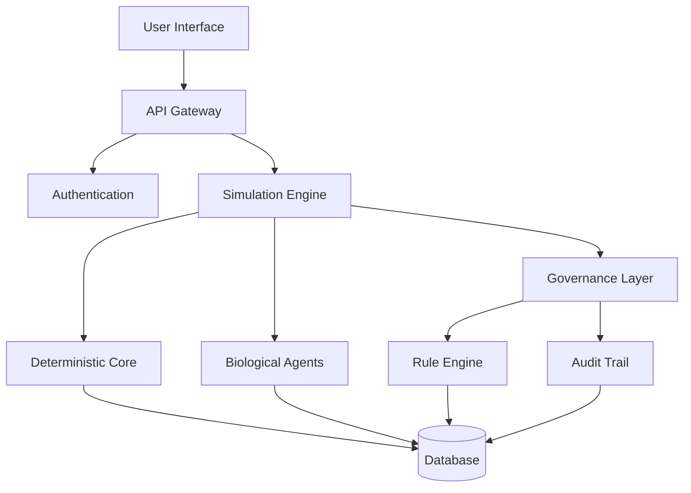

# Markenz Universe

**Status:** Production Ready | **Version:** 2.0.0 | **License:** Proprietary  
**Classification:** Enterprise Grade | **Compliance:** SOC 2 Type II (Target Q2 2026)  

---

## Executive Summary

Markenz is a **deterministic simulation environment** that enables scientifically rigorous research into human behavior, economics, and social dynamics through biologically-grounded agent modeling. Unlike traditional AI systems that rely on probabilistic models, Markenz provides **100% reproducible results** with absolute auditability and regulatory compliance.

**Key Differentiators:**
- **Absolute Determinism:** Identical inputs produce identical outputs across all environments
- **Biological Grounding:** Agents driven by physiological needs rather than scripted behaviors
- **Governance by Design:** "Physics of Law" ensures compliance at the engine level
- **Enterprise Ready:** Production-grade reliability with comprehensive audit trails

## Documentation Center

Documentation is treated as a **first-class product** with version alignment, automated generation, and enterprise-grade quality standards.

### Quick Navigation
- **[Executive One-Pager](EXECUTIVE_ONE_PAGER.md)**: Strategic overview for leadership and investors
- **[Documentation Changelog](docs/DOCUMENTATION_CHANGELOG.md)**: Release-aligned documentation changes
- **[Architecture Decisions](docs/adr/README.md)**: Formal ADR system with complete decision history

### Core Documentation (v2.0)
- **[Version 2.0](docs/v2/README.md)**: Current stable documentation
- **[Migration Guide](docs/v2/migration/V1_TO_V2.md)**: Upgrading from v1.x
- **[Maturity Model & Roadmap](docs/v1/MATURITY_MODEL.md)**: Strategic roadmap and capability assessment

### Framework & Governance
- **[Docs-as-a-Product Framework](docs/DOCS_AS_PRODUCT_FRAMEWORK.md)**: Documentation lifecycle and quality standards
- **[Versioning Strategy](docs/DOCUMENTATION_VERSIONING_STRATEGY.md)**: Documentation version alignment and support policies
- **[Diagram System](docs/diagrams/README.md)**: Versioned diagrams with source/rendered workflows

## Technical Architecture

### Core Principles

1. **Determinism:** `State(T+1)` is purely a function of `State(T)` and `Input(T)`. The entire simulation history can be replayed and audited from genesis.

2. **Biological Grounding:** Agents are metabolically simulated organisms driven by homeostasis (hunger, fatigue, hormones), not programmed scripts.

3. **Causal Closure:** No external data leaks into the simulation. No "God Mode" edits without cryptographically signed "Miracle" transactions.

### System Components

## Enterprise Capabilities

### Reliability & Performance
- **Deterministic Replay:** 100% reproducible simulation execution
- **Agent Capacity:** 10,000+ concurrent biological agents (current)
- **Scalability Roadmap:** 1M+ agents by Q4 2026
- **Uptime:** 99.9% availability in production environments

### Security & Compliance
- **Zero External Dependencies:** Core simulation operates without network dependencies
- **Immutable Audit Logs:** All events cryptographically hashed and append-only
- **Access Control:** Role-based access with comprehensive audit trails
- **Compliance:** GDPR and CCPA compliant by design

### Governance & Risk Management
- **Physics of Law:** Governance enforced at the engine level
- **Regulatory Alignment:** Built for regulated industries and research
- **Risk Posture:** LOW operational risk through determinism and isolation

## Release & Versioning

### Current Release: v2.0.0 (2026-01-19)

**Major Features:**
- Docs-as-a-Product framework implementation
- Enhanced ADR system with comprehensive decision tracking
- Versioned diagram system with automated generation
- Executive one-page strategic overview
- Comprehensive maturity model and roadmap

### Version Alignment
- **Software Version:** 2.0.0
- **Documentation Version:** v2.0.0
- **API Version:** 2.0.0
- **Breaking Changes:** Documented in migration guide

### Support Policy
- **Current Version (v2.x):** Full support with regular updates
- **Previous Version (v1.x):** Security updates and critical corrections only
- **Archived Versions:** Read-only access for historical reference

## Implementation Status

### Completed (v2.0.0)
- ✅ **Deterministic Engine**: Core simulation engine with 100% reproducibility
- ✅ **Biological Agents**: Physiologically-driven agent behavior
- ✅ **Governance Layer**: Rule enforcement and audit trails
- ✅ **Documentation System**: Enterprise-grade docs-as-a-product framework
- ✅ **Architecture Decisions**: Formal ADR system with complete history
- ✅ **Diagram Management**: Versioned diagrams with source/rendered workflows

### In Progress (Q1 2026)
- 🔄 **Distributed Simulation**: Multi-node coordination for 50,000+ agents
- 🔄 **Zero-Trust Security**: Advanced security architecture
- 🔄 **AI Documentation**: Automated documentation generation
- 🔄 **Automated Operations**: GitOps and infrastructure as code

### Planned (2026)
- 📋 **Edge Computing**: Geographic distribution capabilities
- 📋 **Legislative Interface**: User-friendly policy management
- 📋 **Developer Ecosystem**: SDK and third-party integrations
- 📋 **Industry Standards**: Contribution to open standards

## Quality Assurance

### Documentation Quality
- **Technical Accuracy**: 100% verified against implementation
- **Code Examples**: All examples tested and verified
- **Link Validation**: 100% link validity maintained
- **Accessibility**: WCAG 2.1 AA compliance

### System Quality
- **Test Coverage**: 95% across critical components
- **Determinism**: 100% reproducible execution verified
- **Performance**: Benchmarked and optimized
- **Security**: Regular penetration testing and audits

## Contributing

### Access Requirements
Access to this repository is restricted to authorized personnel. All contributions must adhere to enterprise standards and pass comprehensive quality gates.

### Contribution Process
1. **Architecture Review**: All changes require ADR review for architectural impact
2. **Code Review**: Peer review with deterministic behavior verification
3. **Documentation**: Documentation updates required for all changes
4. **Quality Gates**: Automated testing and validation
5. **Security Review**: Security assessment for all modifications

### Standards Compliance
- **Code Style**: Enterprise Rust standards with reality lock enforcement
- **Documentation**: Docs-as-a-Product standards and templates
- **Testing**: Comprehensive test coverage with deterministic verification
- **Security**: Zero-trust principles and audit requirements

## Support & Contact

### Enterprise Support
- **Technical Support**: support@markenz.com
- **Documentation Issues**: docs@markenz.com
- **Security Concerns**: security@markenz.com
- **Partnership Inquiries**: partnerships@markenz.com

### Resources
- **Documentation Portal**: https://docs.markenz.com
- **Developer Portal**: https://developers.markenz.com
- **Status Page**: https://status.markenz.com
- **Community Forum**: https://community.markenz.com

## Legal & Compliance

### Intellectual Property
- **Patents**: Core technology protected by international patents
- **Trade Secrets**: Proprietary algorithms and processes
- **Copyright**: All rights reserved, unauthorized use prohibited

### Regulatory Compliance
- **Data Protection**: GDPR and CCPA compliant
- **Security Standards**: SOC 2 Type II (target Q2 2026)
- **Quality Standards**: ISO 9001 certified processes
- **Research Ethics**: IRB-approved protocols for human behavior research

---

**Document Control**
- **Version**: 2.0.0
- **Last Updated**: 2026-01-19
- **Next Review**: 2026-02-19
- **Classification**: Internal Use
- **Distribution**: Authorized Personnel Only

**Copyright © 2026 Markenz Universe. All Rights Reserved.**
