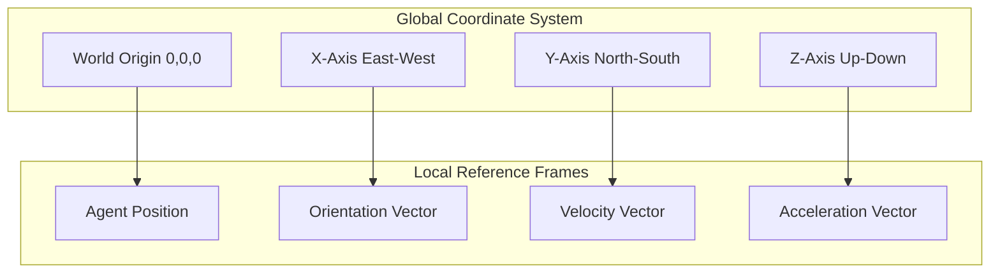
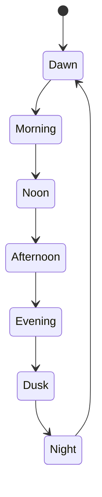
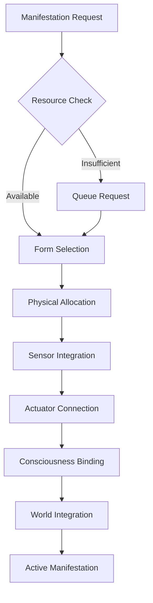

# WORLD_MODEL

## Overview

The World Model defines the physical, spatial, and environmental context in which Gemini agents exist and interact. It provides a consistent physics simulation, spatial awareness system, and environmental dynamics that enable agents to manifest in physical space and maintain context awareness.

## Physics Engine

### Core Physics Principles

The world simulation follows consistent physical laws:

- **Newtonian Mechanics**: Force, mass, and acceleration relationships
- **Conservation Laws**: Energy and momentum conservation
- **Thermodynamics**: Heat transfer and entropy principles
- **Electromagnetic Theory**: Field propagation and interaction

### Spatial Coordinate System



### Motion Dynamics

Agent movement follows realistic physics:

```typescript
interface PhysicsState {
  position: Vector3D;
  velocity: Vector3D;
  acceleration: Vector3D;
  orientation: Quaternion;
  angularVelocity: Vector3D;
  mass: number;
  forces: Force[];
}

interface Vector3D {
  x: number;
  y: number;
  z: number;
  magnitude: number;
}
```

## Spatial Architecture

### Location System

The world is divided into hierarchical spatial regions:

```mermaid
tree
    World[World]
        Continent[Continent]
            Region[Region]
                City[City]
                    District[District]
                        Building[Building]
                            Room[Room]
                                Zone[Zone]
```

### Location Types

- **Natural Environments**: Forests, mountains, oceans, deserts
- **Urban Structures**: Buildings, streets, infrastructure
- **Virtual Spaces**: Digital environments, simulated realities
- **Hybrid Locations**: Mixed physical-virtual interfaces

### Spatial Relationships

Agents maintain awareness of spatial relationships:

- **Proximity Detection**: Distance-based awareness
- **Line of Sight**: Visual and sensor-based visibility
- **Accessibility**: Path finding and navigation
- **Boundary Recognition**: Spatial limits and constraints

## Environmental Dynamics

### Weather Systems

Realistic weather simulation affects agent behavior:

- **Atmospheric Conditions**: Temperature, pressure, humidity
- **Precipitation**: Rain, snow, hail, fog
- **Wind Patterns**: Direction, speed, turbulence
- **Seasonal Changes**: Cyclical environmental variation

### Day/Night Cycles

Circadian rhythm simulation:



### Resource Distribution

Environmental resources are distributed realistically:

- **Energy Sources**: Power generation and distribution
- **Materials**: Raw materials and processed goods
- **Information**: Data networks and communication
- **Services**: Infrastructure and support systems

## Object System

### Physical Objects

The world contains various physical objects:

```typescript
interface PhysicalObject {
  objectId: string;
  objectType: 'static' | 'dynamic' | 'agent';
  position: Vector3D;
  dimensions: Vector3D;
  mass: number;
  material: MaterialProperties;
  state: ObjectState;
  interactions: InteractionCapability[];
}
```

### Material Properties

Objects have realistic material properties:

- **Density**: Mass per unit volume
- **Hardness**: Resistance to deformation
- **Conductivity**: Thermal and electrical properties
- **Durability**: Wear and tear resistance

### Interaction Capabilities

Objects support various interaction types:

- **Manipulation**: Grasping, moving, transforming
- **Sensing**: Data collection and analysis
- **Communication**: Information exchange
- **Processing**: Material transformation

## Agent Manifestation

### Physical Embodiment

Agents can manifest in physical forms:

- **Avatar Selection**: Choice of physical representation
- **Body Configuration**: Size, shape, and capabilities
- **Sensor Arrays**: Perception and awareness systems
- **Actuator Systems**: Movement and manipulation capabilities

### Manifestation Process



### Embodiment Constraints

Physical manifestation operates under constraints:

- **Energy Requirements**: Maintenance and operation costs
- **Material Needs**: Physical component requirements
- **Spatial Limits**: Location and space availability
- **Regulatory Compliance**: Safety and legal restrictions

## Navigation System

### Path Planning

Agents use sophisticated path planning:

- **A* Algorithm**: Optimal path finding
- **Dynamic Replanning**: Real-time path adjustment
- **Collision Avoidance**: Obstacle detection and avoidance
- **Multi-agent Coordination**: Cooperative navigation

### Transportation Modes

Various transportation methods are available:

- **Walking**: Basic bipedal locomotion
- **Vehicles**: Cars, boats, aircraft
- **Public Transit**: Trains, buses, subways
- **Teleportation**: Instant spatial transfer (limited)

### Navigation Aids

Agents utilize navigation assistance:

- **GPS Systems**: Global positioning
- **Local Maps**: Area-specific mapping
- **Landmark Recognition**: Visual navigation
- **Social Navigation**: Following others' guidance

## Simulation Engine

### Time Management

The world simulation manages time consistently:

- **Global Clock**: Universal time reference
- **Time Slices**: Discrete simulation steps
- **Synchronization**: Multi-agent coordination
- **Time Dilation**: Variable time progression

### Event System

World events drive simulation dynamics:

```typescript
interface WorldEvent {
  eventId: string;
  eventType: 'environmental' | 'agent' | 'system';
  timestamp: Date;
  location: Vector3D;
  affectedAgents: string[];
  consequences: EventConsequence[];
}
```

### State Management

World state is maintained efficiently:

- **Spatial Partitioning**: Optimized collision detection
- **Level of Detail**: Variable resolution simulation
- **Culling**: Unnecessary computation elimination
- **Caching**: Frequently accessed data optimization

## Interaction Rules

### Physical Laws

All interactions follow physical laws:

- **Conservation Principles**: Energy and momentum
- **Causality**: Cause-effect relationships
- **Symmetry**: Physical law consistency
- **Determinism**: Predictable outcomes

### Social Norms

Agent interactions follow social conventions:

- **Personal Space**: Respect for boundaries
- **Turn Taking**: Conversation and action ordering
- **Property Rights**: Ownership and access
- **Conflict Resolution**: Disagreement management

### Environmental Constraints

Environmental factors limit interactions:

- **Weather Conditions**: Visibility and mobility
- **Time of Day**: Activity scheduling
- **Resource Availability**: Material and energy limits
- **Safety Regulations**: Risk mitigation requirements

## Data Structures

### World State

```typescript
interface WorldState {
  timestamp: Date;
  agents: AgentState[];
  objects: PhysicalObject[];
  environment: EnvironmentState;
  events: WorldEvent[];
  resources: ResourceDistribution;
}
```

### Environment State

```typescript
interface EnvironmentState {
  weather: WeatherConditions;
  lighting: LightingConditions;
  temperature: number;
  humidity: number;
  airQuality: number;
  noiseLevel: number;
}
```

### Resource Distribution

```typescript
interface ResourceDistribution {
  energy: EnergyGrid;
  materials: MaterialInventory;
  information: DataNetwork;
  services: ServiceAvailability;
}
```

## Performance Optimization

### Spatial Optimization

- **Quadtrees**: 2D spatial partitioning
- **Octrees**: 3D spatial partitioning
- **Bounding Volume Hierarchies**: Multi-level collision detection
- **Portal Culling**: Visibility optimization

### Computational Efficiency

- **Level of Detail**: Variable precision simulation
- **Time Slicing**: Distributed computation
- **Parallel Processing**: Multi-threaded simulation
- **Predictive Caching**: Anticipatory data loading

### Network Optimization

- **Delta Compression**: Change-only updates
- **Interest Management**: Relevant data filtering
- **Load Balancing**: Distributed simulation
- **Bandwidth Management**: Data transfer optimization

## Monitoring & Debugging

### Visualization Tools

- **3D World Viewer**: Interactive environment display
- **Agent Tracking**: Movement and behavior visualization
- **Event Timeline**: Historical event playback
- **Performance Metrics**: System performance monitoring

### Debugging Facilities

- **State Inspection**: Real-time state examination
- **Event Logging**: Comprehensive event recording
- **Breakpoint System**: Simulation pause points
- **Replay System**: Historical simulation replay

---

**Last Updated**: 2026-01-02  
**Version**: 1.0  
**Maintainer**: Gemini Friendship System Team
