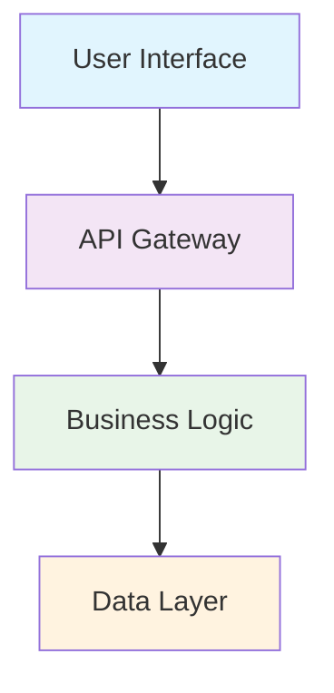

# Diagram System Documentation

**Version:** 1.0  
**Status:** Active  
**Maintainer:** Technical Architecture Team  
**Review Cycle:** Quarterly  

## Overview

This directory contains all architectural and system diagrams for the Markenz project. Diagrams are treated as versioned artifacts with both source files and rendered outputs maintained.

## Directory Structure

```
diagrams/
├── source/                    # Editable diagram source files
│   ├── architecture/          # System architecture diagrams
│   ├── biology/              # Biological system diagrams
│   ├── governance/           # Governance system diagrams
│   ├── deployment/           # Deployment and infrastructure diagrams
│   └── processes/           # Process and workflow diagrams
├── rendered/                 # Generated/rendered diagram outputs
│   ├── png/                  # PNG format for documents
│   ├── svg/                  # SVG format for web
│   └── pdf/                  # PDF format for print
└── tools/                    # Diagram generation tools and scripts
    ├── generate.sh            # Main generation script
    ├── validate.sh            # Diagram validation script
    └── config.yaml           # Generation configuration
```

## Supported Diagram Types

### 1. Architecture Diagrams
- System architecture overviews
- Component interaction diagrams
- Data flow diagrams
- Service architecture

### 2. Biological System Diagrams
- Agent physiology diagrams
- Neural system architecture
- Hormonal system flows
- Metabolic processes

### 3. Governance Diagrams
- Governance layer architecture
- Legal framework structures
- Policy enforcement flows
- Compliance processes

### 4. Deployment Diagrams
- Infrastructure layouts
- Network topology
- Container architecture
- Scaling strategies

## Diagram Formats and Tools

### Source Formats

#### Mermaid (Preferred)
- **File Extension:** `.mmd`
- **Use Cases:** Flowcharts, sequence diagrams, architecture diagrams
- **Advantages:** Text-based, version control friendly, GitHub native rendering
- **Tool:** Visual Studio Code with Mermaid extension

#### PlantUML
- **File Extension:** `.puml`
- **Use Cases:** Complex sequence diagrams, class diagrams
- **Advantages:** Powerful UML support, extensive feature set
- **Tool:** PlantUML online editor or local installation

#### Draw.io (diagrams.net)
- **File Extension:** `.drawio`
- **Use Cases:** Complex layouts, custom graphics, presentations
- **Advantages:** Visual editor, extensive shape library
- **Tool:** diagrams.net web interface or desktop application

#### Graphviz DOT
- **File Extension:** `.dot`
- **Use Cases:** Network diagrams, graph layouts
- **Advantages:** Automated layout, mathematical graph theory
- **Tool:** Graphviz command-line tools

### Rendered Formats

#### PNG (Portable Network Graphics)
- **Use Cases:** Documents, presentations, web display
- **Resolution:** 300 DPI for print, 72 DPI for web
- **Transparency:** Supported for web use

#### SVG (Scalable Vector Graphics)
- **Use Cases:** Web documentation, responsive displays
- **Advantages:** Infinite scaling, small file size
- **Compatibility:** Modern browsers and documentation tools

#### PDF (Portable Document Format)
- **Use Cases:** Print documentation, formal reports
- **Advantages:** Consistent formatting, print optimization
- **Compatibility:** Universal document standard

## Diagram Creation Workflow

### 1. Planning and Design

#### Requirements Gathering
1. Identify diagram purpose and audience
2. Define scope and level of detail
3. Choose appropriate diagram type
4. Plan information hierarchy

#### Sketch and Review
1. Create initial sketch (paper or digital)
2. Review with stakeholders
3. Iterate on design and content
4. Finalize diagram structure

### 2. Source File Creation

#### File Naming Convention
```
{category}/{purpose}_{version}.{format}
```

Examples:
- `architecture/system_overview_v1.mmd`
- `biology/agent_physiology_v2.puml`
- `governance/legal_framework_v1.drawio`

#### Source File Standards
1. Include header comment with metadata
2. Use consistent styling and colors
3. Add meaningful comments for complex sections
4. Follow naming conventions for elements

#### Source File Template


### 3. Generation and Validation

#### Automated Generation
```bash
# Generate all diagrams
./tools/generate.sh --all

# Generate specific category
./tools/generate.sh --category architecture

# Generate specific diagram
./tools/generate.sh --file architecture/system_overview_v1.mmd
```

#### Validation Process
```bash
# Validate all diagrams
./tools/validate.sh --all

# Check for broken references
./tools/validate.sh --references

# Verify rendering quality
./tools/validate.sh --quality
```

### 4. Review and Approval

#### Technical Review
1. Verify technical accuracy
2. Check consistency with implementation
3. Validate diagram logic and flow
4. Ensure proper notation usage

#### Style Review
1. Check visual consistency
2. Verify color scheme compliance
3. Validate text readability
4. Ensure accessibility compliance

#### Final Approval
1. Architecture team sign-off
2. Documentation team review
3. Update documentation references
4. Commit to version control

## Diagram Maintenance

### Version Management

#### Versioning Strategy
- **Major Version:** Structural changes, significant content updates
- **Minor Version:** Content additions, style improvements
- **Patch Version:** Error corrections, minor adjustments

#### Version Control
1. All source files under version control
2. Rendered files generated from source
3. Version tags for major releases
4. Branching for experimental changes

### Update Process

#### Regular Updates
1. Quarterly review of all diagrams
2. Updates for system changes
3. Accuracy verification
4. Style consistency checks

#### Emergency Updates
1. Critical accuracy issues
2. Security-related changes
3. Major system updates
4. Documentation errors

### Quality Assurance

#### Automated Checks
1. Source file syntax validation
2. Rendering success verification
3. File size optimization
4. Format compliance checking

#### Manual Reviews
1. Technical accuracy verification
2. Visual quality assessment
3. Accessibility compliance
4. Documentation integration

## Integration with Documentation

### Documentation References

#### Markdown Integration
```markdown


*Figure 1: System Architecture Overview (see [source](../diagrams/source/architecture/system_overview_v1.mmd))*
```

#### HTML Integration
```html

```

#### PDF Integration
- High-resolution PNG files for print
- Optimized file sizes for document inclusion
- Consistent styling with document theme

### Cross-Reference Management

#### Diagram Index
- Central index of all diagrams
- Metadata including purpose, version, dependencies
- Usage tracking and popularity metrics

#### Dependency Tracking
- Source file dependencies
- Documentation references
- Implementation links

## Tools and Automation

### Generation Scripts

#### Main Generation Script
```bash
#!/bin/bash
# tools/generate.sh

set -e

SCRIPT_DIR="$(cd "$(dirname "${BASH_SOURCE[0]}")" && pwd)"
SOURCE_DIR="$SCRIPT_DIR/../source"
RENDERED_DIR="$SCRIPT_DIR/../rendered"

generate_mermaid() {
    local file="$1"
    local basename=$(basename "$file" .mmd)
    local category=$(dirname "$file" | sed 's|.*/||')
    
    mmdc -i "$file" -o "$RENDERED_DIR/png/${basename}.png"
    mmdc -i "$file" -o "$RENDERED_DIR/svg/${basename}.svg"
}

# Generate all diagrams
find "$SOURCE_DIR" -name "*.mmd" | while read file; do
    generate_mermaid "$file"
done
```

#### Validation Script
```bash
#!/bin/bash
# tools/validate.sh

validate_mermaid() {
    local file="$1"
    mmdc -i "$file" -o /tmp/test.png --quiet
    if [ $? -eq 0 ]; then
        echo "✓ $file: Valid Mermaid syntax"
    else
        echo "✗ $file: Invalid Mermaid syntax"
        return 1
    fi
}

# Validate all source files
find "$SOURCE_DIR" -name "*.mmd" | while read file; do
    validate_mermaid "$file"
done
```

### Configuration Management

#### Generation Configuration
```yaml
# tools/config.yaml
generation:
  formats:
    - png
    - svg
    - pdf
  
  quality:
    png_dpi: 300
    svg_optimization: true
    pdf_compression: true
  
  styling:
    theme: default
    color_scheme: professional
    font_family: Arial
    font_size: 12
  
  validation:
    syntax_check: true
    reference_check: true
    quality_check: true
```

## Best Practices

### Design Principles

1. **Clarity First:** Prioritize clarity over complexity
2. **Consistency:** Use consistent styling across all diagrams
3. **Accessibility:** Ensure diagrams are accessible to all users
4. **Maintainability:** Design for easy updates and modifications

### Content Guidelines

1. **Audience Awareness:** Tailor complexity to target audience
2. **Progressive Disclosure:** Use layered detail for complex topics
3. **Standard Notation:** Use industry-standard diagram notations
4. **Complete Information:** Include necessary context and legends

### Technical Standards

1. **Source Control:** Always maintain source files
2. **Version Consistency:** Keep source and rendered versions synchronized
3. **Documentation:** Document diagram purpose and assumptions
4. **Testing:** Validate diagram accuracy regularly

---

**Diagram System Authority:** This system is maintained by the Technical Architecture Team and requires formal review for any modifications to diagram standards or processes.
